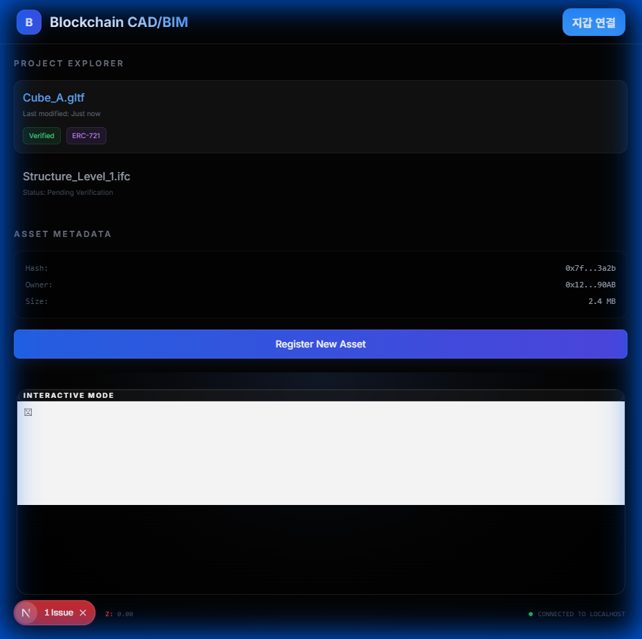

# Blockchain CAD/BIM

A modern Decentralized Application (dApp) for verifying, viewing, and managing 3D CAD/BIM models on the blockchain.



## Features

- **Interactive 3D Viewer**: High-fidelity rendering with React Three Fiber, featuring:
  - Professional studio lighting (Stage)
  - Infinite Grid for spatial context
  - Interactive elements with hover effects
  - Orbit controls with auto-rotation and damping
- **Blockchain Integration**:
  - Wallet connection via **RainbowKit** & **Wagmi**
  - Asset verification status display
  - Mock BIM data structure (IFC/GLTF)
- **Premium UI/UX**:
  - **Glassmorphism**: Backdrop blurs and semi-transparent layers
  - **Responsive Design**: Tailored for both desktop and large screens
  - **Dark Mode**: Sleek, professional aesthetic suitable for CAD tools

## Tech Stack

- **Framework**: [Next.js 15](https://nextjs.org/) (App Router)
- **3D Engine**: [Three.js](https://threejs.org/)
  - [@react-three/fiber](https://docs.pmnd.rs/react-three-fiber): React renderer for Three.js
  - [@react-three/drei](https://github.com/pmndrs/drei): Useful helpers
- **Web3**:
  - [Wagmi](https://wagmi.sh/): React Hooks for Ethereum
  - [RainbowKit](https://www.rainbowkit.com/): Wallet connection primitives
  - [Viem](https://viem.sh/): TypeScript interface for Ethereum
- **Styling**: [TailwindCSS](https://tailwindcss.com/)

## Getting Started

### Prerequisites

- Node.js (v18 or higher)
- npm or yarn

### Installation

1. Clone the repository:
   ```bash
   git clone https://github.com/tomeido/blockchain-cad-bim.git
   cd blockchain-cad-bim
   ```

2. Install dependencies:
   ```bash
   npm install
   ```

### Development

Run the development server:

```bash
npm run dev
```

Open [http://localhost:3000](http://localhost:3000) with your browser to see the application.

## Project Structure

- `/app`: Next.js App Router pages and layouts
- `/components`: Reusable UI and 3D components (e.g., `Viewer.tsx`)
- `/contracts`: Solidity smart contracts (e.g., `BuildingRegistry.sol`)
- `/config`: Web3 configuration (Wagmi/RainbowKit)

## License

MIT
